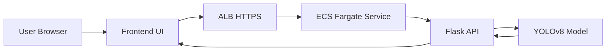
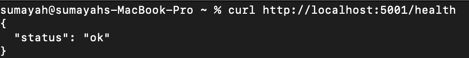

# 🚀 YOLOv8 MLOps Project — Production Deployment on AWS ECS


> Production-grade MLOps system deploying an object detection model using Docker, Terraform, AWS ECS (Fargate), and CI/CD with full HTTPS support.

---

## 📌 Project Overview

This project is an end-to-end MLOps application that deploys a YOLOv8 object detection model as a production-ready web service on AWS.

Users can upload an image through a frontend interface, which sends the request to a Flask-based API. The API performs inference using a pre-trained YOLOv8 model and returns detected objects with bounding boxes and confidence scores.

The application is fully containerised using Docker and deployed on AWS ECS (Fargate) behind an Application Load Balancer with HTTPS enabled via AWS Certificate Manager and Route53.

All infrastructure is provisioned using Terraform, and deployments are automated through a CI/CD pipeline using GitHub Actions.

This project demonstrates real-world MLOps practices, including model serving, container orchestration, infrastructure as code, and automated deployments.

This project demonstrates a **real-world MLOps workflow**, taking a machine learning model from:

**Local Development → Containerisation → Cloud Deployment → Infrastructure as Code → CI/CD Automation**

Unlike traditional ML projects, this focuses on **deployment, scalability, and production readiness**.

---

## 🧠 Key Features

- YOLOv8 object detection API  
- Full-stack application (Frontend + Flask backend)  
- Dockerised services (production-ready)  
- AWS ECS (Fargate) deployment  
- HTTPS with custom domain (Route53 + ACM)  
- Infrastructure as Code using Terraform  
- CI/CD pipeline with GitHub Actions  
- Health checks and automated deployments  

---

## 🏗️ Architecture

### 🔁 System Flow



## 📁 Project Structure

```
.
├── app/
│   ├── frontend/
│   ├── backend/
│   ├── Dockerfile(s)
│   └── .dockerignore
│
├── infra/
│   ├── main.tf
│   ├── variables.tf
│   ├── outputs.tf
│   └── modules/
│
├── .github/
│   └── workflows/
│       └── deploy.yml
│
├── README.md
└── .gitignore

```


## 🖥️ Application
Backend (Flask API)
- Health → Service health check
- Predict → Object detection endpoint
- Loads YOLOv8 model (yolov8n.pt)
- Returns:
- Bounding boxes
- Labels
- Confidence scores

### Application

#### Health Check Endpoint

The `/health` endpoint verifies that the Flask API is running correctly.

```bash
curl http://localhost:5001/health
```
{"status":"ok"}

<p align="centlefter">
  
</p>


Frontend
- Image upload interface
- Sends requests to /predict
- Displays detection results

🐳 Containerisation
- Multi-stage Docker builds
- Non-root user for security
- Lightweight base images
- Separate frontend/backend services


## 📦 Container Registry (ECR)

- Images are stored in Amazon ECR.

- docker tag yolov8-backend:latest <ecr-repo>:tag
- docker push <ecr-repo>:tag

## ☁️ Deployment (AWS ECS - Fargate)
- Services Used
- ECS (Fargate)
- ECR
- Application Load Balancer
- Route53
- AWS Certificate Manager (ACM)
- IAM
- VPC


## 🏗️ Infrastructure as Code (Terraform)

All AWS infrastructure is provisioned using Terraform.


## 🔁 CI/CD Pipeline

Implemented using GitHub Actions.

- Pipeline Stages
- Build Docker images
- Push images to ECR
- Deploy infrastructure (Terraform)
- Update ECS service
- Run health checks


## 📸 Screenshots (To Add)
- Application
- UI with object detection results
- API response output
- Docker
- Running containers locally
- AWS
- ECS service
- ALB configuration
- HTTPS working
- CI/CD
- GitHub Actions pipeline

