# 🚀 YOLOv8 MLOps Project — Production Deployment on AWS ECS


> Production-grade MLOps system deploying an object detection model using Docker, Terraform, AWS ECS (Fargate), and CI/CD with full HTTPS support.

---

## 📌 Project Overview

This project is an end-to-end MLOps application that deploys a YOLOv8 object detection model as a production-ready web service on AWS.

Users can upload an image through a frontend interface, which sends the request to a Flask-based API. The API performs inference using a pre-trained YOLOv8 model and returns detected objects with bounding boxes and confidence scores.

The application is fully containerised using Docker and deployed on AWS ECS (Fargate) behind an Application Load Balancer with HTTPS enabled via AWS Certificate Manager and Route53.

All infrastructure is provisioned using Terraform, and deployments are automated through a CI/CD pipeline using GitHub Actions.

This project demonstrates real-world MLOps practices, including model serving, container orchestration, infrastructure as code, and automated deployments.

This project demonstrates a **real-world MLOps workflow**, taking a machine learning model from:

**Local Development → Containerisation → Cloud Deployment → Infrastructure as Code → CI/CD Automation**

Unlike traditional ML projects, this focuses on **deployment, scalability, and production readiness**.

---

## 🧠 Key Features

- YOLOv8 object detection API  
- Full-stack application (Frontend + Flask backend)  
- Dockerised services (production-ready)  
- AWS ECS (Fargate) deployment  
- HTTPS with custom domain (Route53 + ACM)  
- Infrastructure as Code using Terraform  
- CI/CD pipeline with GitHub Actions  
- Health checks and automated deployments  

---

## 🏗️ Architecture

### 🔁 System Flow

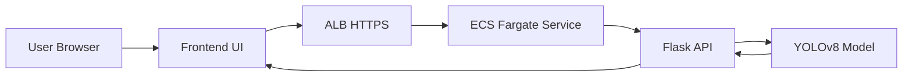

## 📁 Project Structure

```
.
├── app/
│   ├── frontend/
│   ├── backend/
│   ├── Dockerfile(s)
│   └── .dockerignore
│
├── infra/
│   ├── main.tf
│   ├── variables.tf
│   ├── outputs.tf
│   └── modules/
│
├── .github/
│   └── workflows/
│       └── deploy.yml
│
├── README.md
└── .gitignore

```


## 🖥️ Application
Backend (Flask API)
- Health → Service health check
- Predict → Object detection endpoint
- Loads YOLOv8 model (yolov8n.pt)
- Returns:
- Bounding boxes
- Labels
- Confidence scores

### Application

#### Health Check Endpoint

The `/health` endpoint verifies that the Flask API is running correctly.

```bash
curl http://localhost:5001/health
```
{"status":"ok"}

<p align="left">
  
</p>

### Application — Object Detection

The `/predict` endpoint performs real-time object detection using the YOLOv8 model.


```bash
curl -X POST -F "image=@test.jpg" http://localhost:5001/predict
```

[
  {
    "bbox": [130.57, 129.97, 3687.63, 1657.32],
    "confidence": 0.88,
    "label": 2
  }
]

<p align="left">
  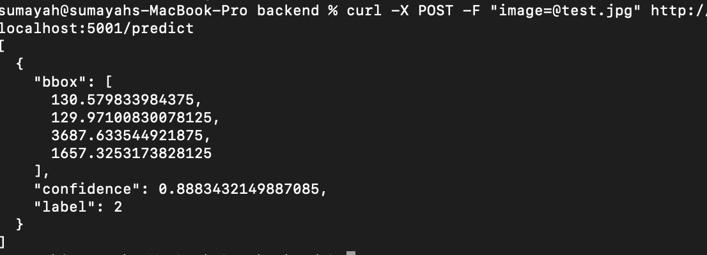
</p>


Frontend
- Image upload interface
- Sends requests to /predict
- Displays detection results

### Application — Frontend UI

The frontend allows users to upload an image and perform real-time object detection using the YOLOv8 model.


🐳 Containerisation
- Multi-stage Docker builds
- Non-root user for security
- Lightweight base images
- Separate frontend/backend services

The backend API is fully containerised using Docker and runs inside an isolated environment with all dependencies installed.

The container exposes port `5000`, which is mapped to port `5002` on the host machine.

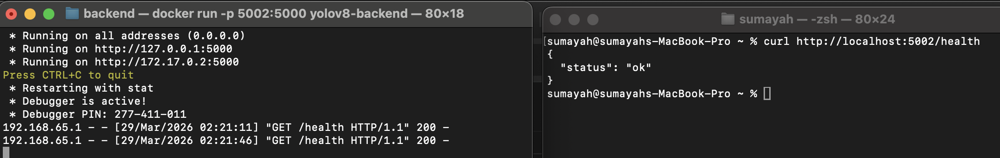

### 🔍 Verification

The container is verified using:

- `docker ps` to confirm it is running  
- `/health` endpoint to confirm API availability  


## 🌐 Full System — End-to-End Application

The complete application is running locally with:

- Frontend served via a lightweight HTTP server  
- Backend running inside a Docker container  
- YOLOv8 model performing real-time object detection  
- API communication over HTTP  

Users can upload an image and receive detection results including bounding boxes, labels, and confidence scores.

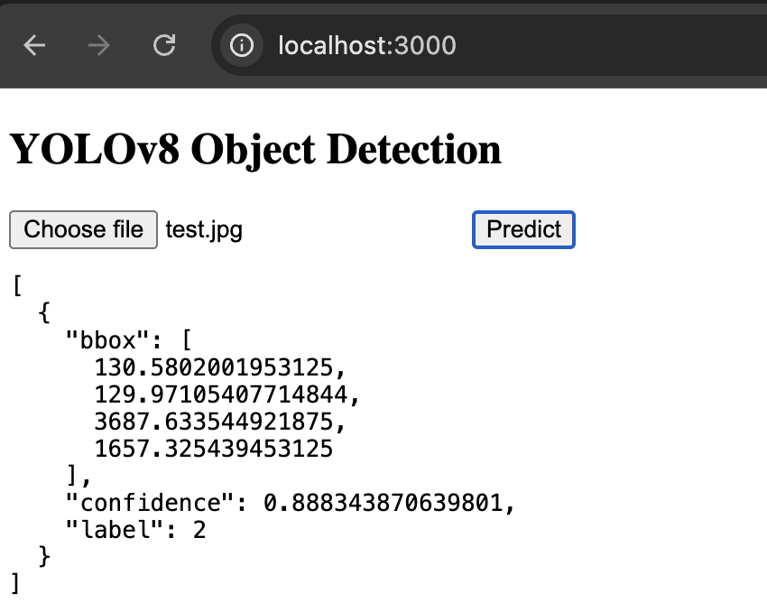


## 📦 Container Registry (ECR)

- Images are stored in Amazon ECR.

- docker tag yolov8-backend:latest <ecr-repo>:tag
- docker push <ecr-repo>:tag

The Docker image is pushed to Amazon Elastic Container Registry (ECR) for deployment.

Optimised ML container images and learned about dependency size management.

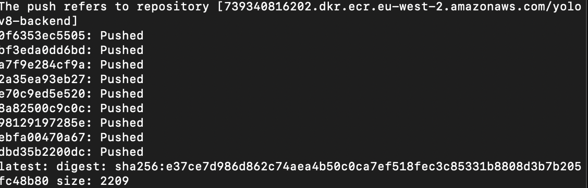


### 💰 Cost Considerations

- ECR storage: ~$0.50/month  
- ECS + ALB: ~$1.50/day when running  
- Resources are destroyed after testing to minimize cost


## ☁️ Deployment (AWS ECS - Fargate)
- Services Used
- ECS (Fargate)
- ECR
- Application Load Balancer
- Route53
- AWS Certificate Manager (ACM)
- IAM
- VPC


# ☁️ AWS ECS Fargate Deployment

The containerised YOLOv8 Flask backend was successfully deployed to AWS ECS using Fargate behind an Application Load Balancer (ALB).

This section documents the full deployment workflow, debugging process, infrastructure setup, and final production deployment.

---

# AWS Services Used

- Amazon ECS (Fargate)
- Amazon Elastic Container Registry (ECR)
- Application Load Balancer (ALB)
- IAM Roles
- VPC Networking
- Security Groups
- CloudWatch Logs
- ECS Task Definitions
- ECS Services

---

# Deployment Features Implemented

- Docker container deployment to ECS
- Container image hosting in Amazon ECR
- ECS cluster provisioning
- ECS service configuration
- Application Load Balancer integration
- Public endpoint exposure
- Health check configuration
- CloudWatch logging
- ECS deployment troubleshooting
- ARM64 vs x86_64 architecture debugging
- ECS task recovery workflows

---

# 🚀 Deployment Workflow

---

# 1️⃣ Create Amazon ECR Repository

An Amazon Elastic Container Registry (ECR) repository was created to host the backend Docker images.

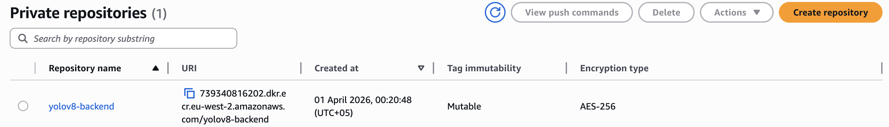

---

# 2️⃣ Build and Tag Docker Image

The YOLOv8 backend Docker image was built locally and tagged for ECR deployment.

```bash
docker build -t yolov8-backend .
docker tag yolov8-backend:latest \
739340816202.dkr.ecr.eu-west-2.amazonaws.com/yolov8-backend:latest
```

---

# 3️⃣ Authenticate Docker with Amazon ECR

Docker authentication was configured using AWS CLI credentials.

```bash
aws ecr get-login-password --region eu-west-2 \
| docker login --username AWS --password-stdin \
739340816202.dkr.ecr.eu-west-2.amazonaws.com
```

---

# 4️⃣ Push Docker Image to ECR

The Docker image was successfully pushed to the ECR repository.

## Docker Push In Progress

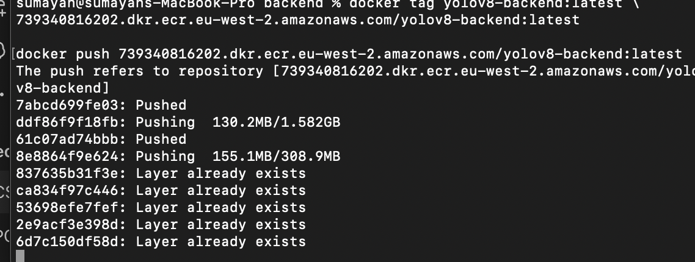

---

## Docker Push Progress

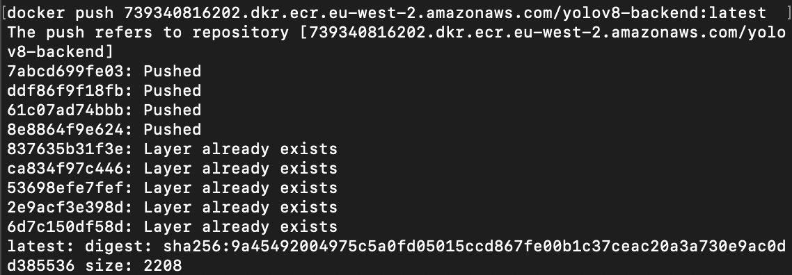

---

## Docker Push Completed Successfully

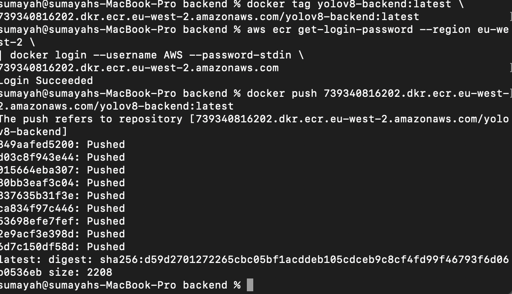

---

# 5️⃣ Verify Uploaded Docker Image in ECR

The uploaded container image was verified inside Amazon ECR.

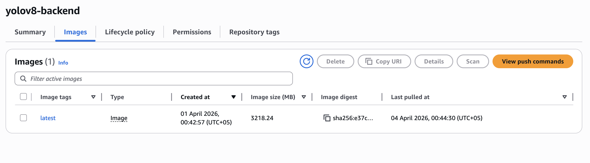

---

# 6️⃣ Create ECS Cluster

An ECS cluster was created successfully for AWS Fargate deployment.

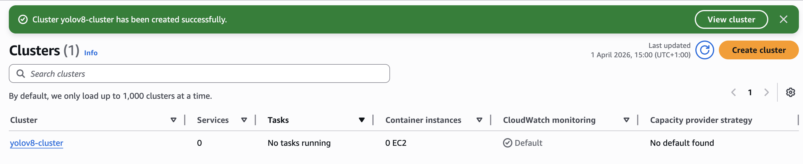

---

# ⚠️ ECS Deployment Troubleshooting

Several deployment issues occurred during production rollout and were debugged using ECS task monitoring and CloudWatch logs.

---

# 7️⃣ Initial ECS Service Deployment Failure

The ECS service deployment initially failed and rolled back automatically.

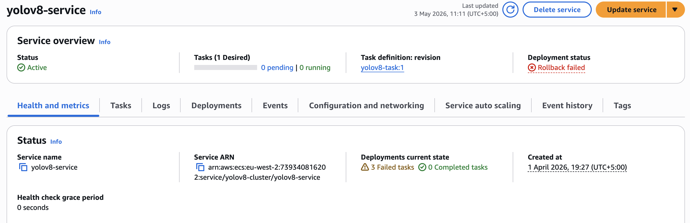

---

# 8️⃣ ECS Rollback Triggered

The ECS deployment circuit breaker triggered a rollback because tasks failed health checks.

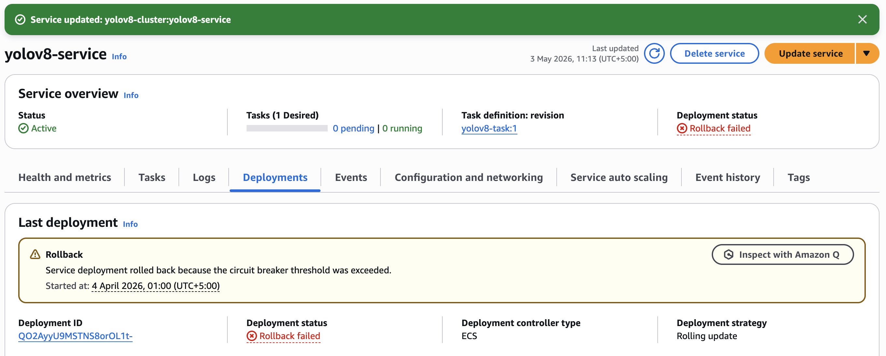

---

# 9️⃣ ECS Tasks Stuck in Pending State

During troubleshooting, ECS tasks remained in a pending state while debugging container startup issues.

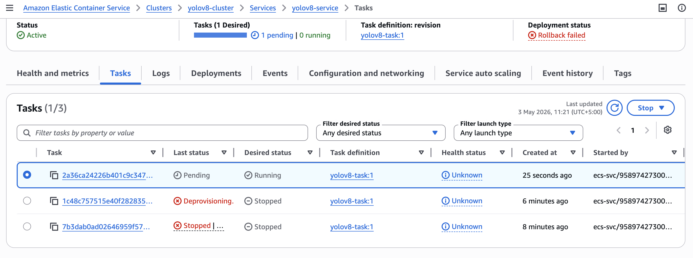

---

# 🔟 CloudWatch Runtime Error Investigation

CloudWatch logs revealed the following runtime error:

```text
exec /usr/local/bin/python: exec format error
```

This occurred because the Docker image was built for ARM64 architecture instead of x86_64, which ECS Fargate expected.

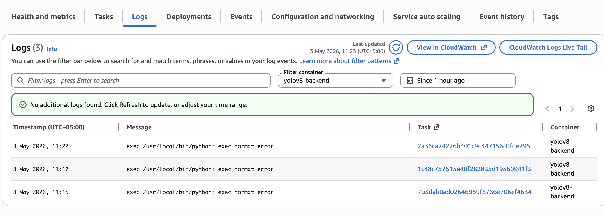

---

# 🛠️ Resolving the Architecture Issue

The Docker image was rebuilt for the correct Linux AMD64 platform.

```bash
docker buildx build \
--platform linux/amd64 \
-t yolov8-backend:latest .
```

The rebuilt image was then re-tagged and pushed to Amazon ECR.

---

# ✅ Successful ECS Deployment

After rebuilding and redeploying the container image, the ECS tasks started successfully and the API became publicly accessible.

---

# 1️⃣1️⃣ Direct ECS Task Health Check

The Flask API successfully responded from the ECS task public IP address.


---

# 1️⃣2️⃣ ALB Health Check Endpoint Success

The Application Load Balancer successfully routed traffic to the ECS service health endpoint.

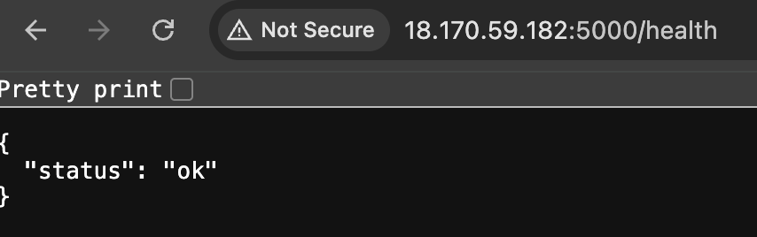

---

# 1️⃣3️⃣ Final Production Endpoint Working

The final production endpoint successfully returned a valid response through the Application Load Balancer.

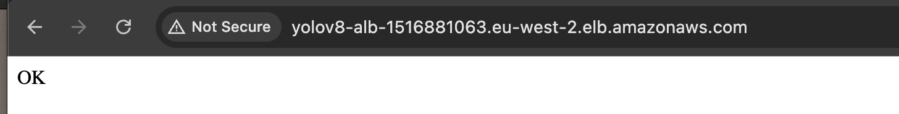

---

# ✅ Deployment Successfully Verified

The following production deployment functionality was successfully verified:

- ECS Fargate deployment
- Docker container orchestration
- ECR image hosting
- ECS task scheduling
- ALB traffic routing
- Health check monitoring
- Public endpoint accessibility
- CloudWatch debugging workflows
- ECS rollback troubleshooting
- Architecture compatibility debugging
- Production Flask API deployment

---

# 📌 Final Result

The YOLOv8 Flask backend is now successfully containerised and deployed on AWS ECS Fargate behind an Application Load Balancer with working public endpoints and health monitoring.


## 🏗️ Infrastructure as Code (Terraform)

All AWS infrastructure is provisioned using Terraform.


## 🔁 CI/CD Pipeline

Implemented using GitHub Actions.

- Pipeline Stages
- Build Docker images
- Push images to ECR
- Deploy infrastructure (Terraform)
- Update ECS service
- Run health checks


## 📸 Screenshots (To Add)
- Application
- UI with object detection results
- API response output
- Docker
- Running containers locally
- AWS
- ECS service
- ALB configuration
- HTTPS working
- CI/CD
- GitHub Actions pipeline

